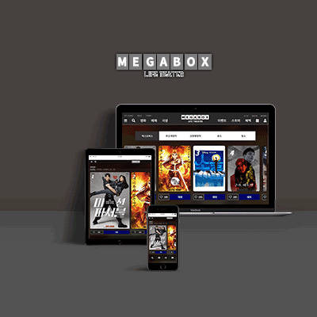

# 서정완의 포트폴리오
## 개발 환경
- OS
    - Window, Mac
- Tools
    - PhotoShop
    - Illustrator
    - Visual Studio Code
    - HTML
    - CSS
    - javaScript
    - jQuery

 
---
시작전 GitHub에 올리기엔 용량이 너무 많다보니
분할하여서 올렸습니다.
portfolio_index.zip, megabox.zip을 압축해체 후
megabox폴더를 portfolio_index로 이동하셔야 합니다.
 

## 프로젝트
저의 `프로젝트`를 소개하겠습니다.   
    

           
        
기존의 적응형 페이지에서
        반응형 웹페이지로 제작을 하였습니다
        메인 이미지를 슬라이드로 제작하여
        다른 영화를 보다 더 쉽게 확인 가능할수 있습니다.
        큐레이션 섹션같은경우 정보를 더욱 편하게
        확인 할수있도록 mouse이벤트를 이용해주었습니다.

        
        
기존의 적응형 페이지에서 반응형 웹페이지로 제작하였습니다

        
        
기존의 적응형 페이지에서 반응형 웹페이지로 제작하였습니다

        
        
기존의 적응형 페이지에서 반응형 웹페이지로 제작하였습니다

        
        
기존의 풀페이지 슬라이드 형식의 페이지를 리뉴얼
        하여 반응형 웹페이지로 제작하였습니다.
        가독성을 고려하여 기존보다 폰트 크기를 키웠습니다.

    

